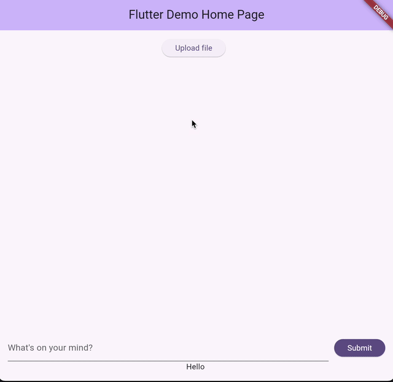

# RAGFlex

RAGFlex is a flexible Retrieval Augmented Generation (RAG) framework that allows you to configure pipeline with [hydra](https://hydra.cc/) configuration files with [FastAPI](https://fastapi.tiangolo.com/) as the backend and [flutter](https://flutter.dev/) as the frontend.

## Features
- Configure RAG pipeline with hydra configuration files
- Use FastAPI as the backend
- Use flutter as the frontend


## Quick look



# Getting started
## Setup with conda
```bash
# Create a new conda environment
conda env create -f environment.yml

# Activate the environment
conda activate ragflex
```

## Start the backend
```bash
cd python

# If you are using the default openai api configuration
OPENAI_API_KEY=$OPENAI_API_KEY python fastapi_main.py
```

## Start the frontend

```bash
cd flutter

# Run as a web server
flutter run -d web-server --web-hostname=0.0.0.0
```
